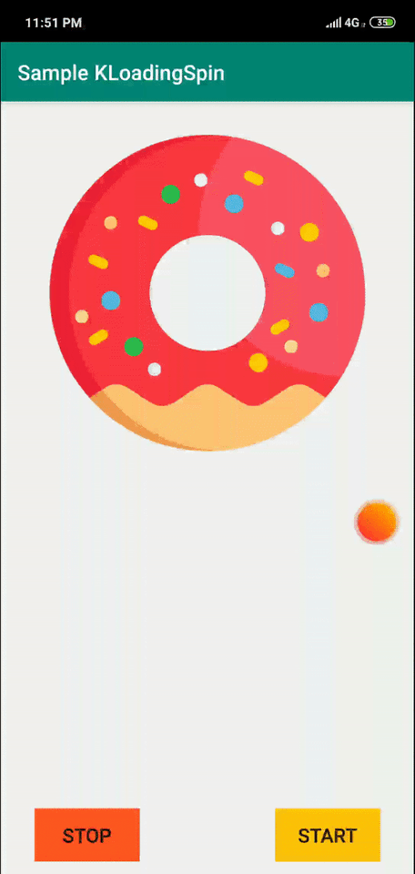

## Preview



## Gradle Dependency
- Add jitpack to your project

```gradle
allprojects {
		repositories {
			...
			maven { url 'https://jitpack.io' }
		}
	}
```
- Add the dependency
``` gradle
dependencies {
    implementation 'com.github.Nikoloutsos:KLoadingSpin:1.0.0'
 }
 ```

## Usage

- Add it in your xml and make it fill the entire screen.


```xml
<com.example.kloadingspin.KLoadingSpin
       android:id="@+id/KLoadingSpin"
       android:layout_width="match_parent"
       android:layout_height="match_parent"
       app:backgroundColor="#55008DFF"
       app:primarySpinnerColor="#ffffff"
       app:rotationSpeedInMs="3000"
       app:text="Searching for the best \n data for you..."
       app:secondarySpinnerColor="#FF9800"
       app:textColor="#ffffff"
       app:textSize="80" />
 ```
 

 
 - Run the following code to show/hide
 
  ```java
	// For showing
	KLoadingSpin a = findViewById(R.id.loading);
	a.startAnimation();
        a.setIsVisible(true);
	
	// For hiding
	KLoadingSpin a = findViewById(R.id.loading);
	a.stopAnimation()
	
   ```   
 

## Customize

| xml attribute | description  |
| ------------- | :--- |
| <b>app:backgroundColor</b>  | The color of the background (don't forget to use alpha) <br> e.g #40FF0000 not #FF0000 |
| <b>app:primarySpinnerColor</b> | The color of the spinning circle(The one with curcular motion)|
| <b>app:secondarySpinnerColor</b> | The color of the spinning circle(The oposite of primarySpinnerColor )|
| <b>app:rotationSpeedInMs</b> | The time in milliseconds for 1 full cycle animation|
| <b>app:text</b> | The text that will be displayed under the loading animation|
| <b>app:textColor</b> | The color of the text|
| <b>app:textSize</b> | The size of the text (Recommended size: 70)|


